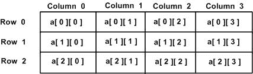

# 多维数组

> 原文：<https://www.learn-c.org/en/Multidimensional_Arrays>

* * *

在之前关于[数组](https://www.learn-c.org/en/Arrays)的教程中，我们介绍了数组以及它们是如何工作的。我们看到的数组都是一维的，但是 C 可以创建和使用多维数组。以下是多维数组声明的一般形式:

```cpp
type name[size1][size2]...[sizeN]; 
```

举个例子，这是一个基本的例子，你可以看看-

```cpp
int foo[1][2][3]; 
```

或者这个-

```cpp
char vowels[1][5] = {
    {'a', 'e', 'i', 'o', 'u'}
}; 
```

### 二维数组

多维数组最简单的形式是二维数组。二维数组实际上是一维数组的列表。要声明一个大小为[ x ][ y ]的二维整数数组，您应该编写如下代码

```cpp
type arrayName [x][y]; 
```

其中 **type** 可以是任意 C 数据类型(int、char、long、long long、double 等。)和 **arrayName** 将是一个有效的 C 标识符或变量。二维数组可以被认为是一个有[ x ]行和[ y ]列的表。包含三行四列的二维数组 a 可以这样显示和思考



在这种意义上，数组 a 中的每个元素由形式为 **a[i][j]** 的元素名称来标识，其中“a”是数组的名称，“I”和“j”是唯一标识或显示“a”中每个元素的索引。

老实说，你真的不需要输入 x 值，因为如果你做了这样的事情-

```cpp
char vowels[][5] = {
    {'A', 'E', 'I', 'O', 'U'},
    {'a', 'e', 'i', 'o', 'u'}
}; 
```

编译器已经知道你可以说有两个“维度”，但是，你需要一个[ y ]值！！编译器可能很聪明，但是它*不知道*维度中有多少整数，字符，浮点数，不管你用的是什么。记住这一点。

### 初始化二维数组

可以通过为每行指定括号[]值来使用多维数组。下面是一个 3 行的数组，每行有 4 列。为了使它更容易，你可以忘记 3，让它保持空白，它仍然会工作。

```cpp
int a[3][4] = {  
   {0, 1, 2, 3} ,   /*  initializers for row indexed by 0 */
   {4, 5, 6, 7} ,   /*  initializers for row indexed by 1 */
   {8, 9, 10, 11}   /*  initializers for row indexed by 2 */
}; 
```

表示所需行的内括号是可选的。以下初始化与上例相同

```cpp
int a[3][4] = {0,1,2,3,4,5,6,7,8,9,10,11}; 
```

### 访问二维数组元素

二维数组中的元素通过使用下标，即数组的行索引和列索引来访问。例如

```cpp
int val = a[2][3]; 
```

上述语句将从数组的第 3 行中取出第 4 个元素。

## 练习

让我们试着找出一组五个学生在数学和物理两个科目上的平均分数。为此，我们使用一个名为`grades`的二维数组。对应于数学的分数将被存储在第一行(`grades[0]`)，而对应于物理的分数将被存储在第二行(`grades[1]`)。完成以下步骤，以便您可以执行该程序。

*   将成绩声明为二维整数数组
*   通过指定终止条件来完成 for 循环
*   计算每个科目的平均分数