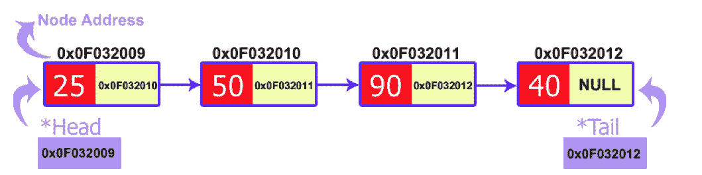
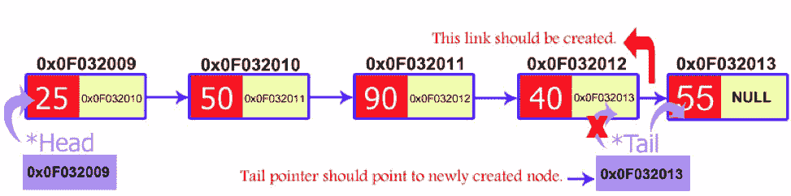
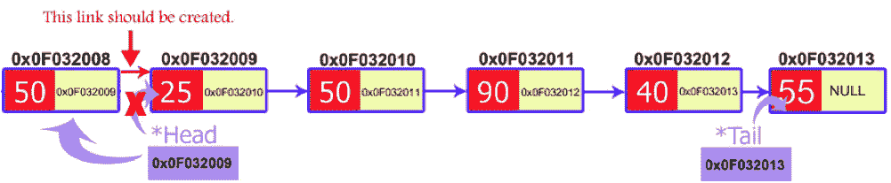

# 链表

> 原文:[https://www.learn-cpp.org/en/Linked_lists](https://www.learn-cpp.org/en/Linked_lists)

* * *

### 介绍

链表是使用指针实现的动态数据结构的最好和最简单的例子。然而，理解指针对于理解链表如何工作是至关重要的，所以如果你跳过了指针教程，你应该回去重做一遍。您还必须熟悉动态内存分配和结构。

本质上，链表就像一个数组，可以根据需要从数组中的任何一点开始增长和收缩。

与数组相比，链表有几个优点:

1.  可以在列表中间添加或删除项目
2.  不需要定义初始大小

然而，链表也有一些缺点:

1.  不存在“随机”访问——如果不首先遍历所有的项直到第 n 项，就不可能到达数组中的第 n 项。这意味着我们必须从列表的开头开始，并计算我们在列表中前进了多少次，直到我们找到想要的项目。
2.  需要动态内存分配和指针，这使代码变得复杂，并增加了内存泄漏和段错误的风险。
3.  链表的开销比数组大得多，因为链表项是动态分配的(这在内存使用方面效率较低)，而且链表中的每一项还必须存储一个额外的指针。

### 什么是链表？

链表是一组动态分配的节点，每个节点包含一个值和一个指针。指针总是指向列表的下一个成员。如果指针是`nullptr`，那么它是列表中的最后一个节点。



让我们定义一个链表节点:

```
struct Node {
    int value;
    struct Node * next;
}; 
```

使用指向称为“头”的链表的第一项的指针和指向称为“尾”的链表的最后一项的指针来保存链表。如果该指针(“尾部”)也是`nullptr`，那么该列表被认为是空的。

让我们定义一个链表:

```
class LinkedList
{
public:
    LinkedList()
    {
        head = nullprt;
        tail = nullptr;
    }

private:
    Node *head;
    Node *tail;
}; 
```

### 添加项目(到链表的末尾)

现在我们可以使用节点。让我们创建一个方法`createNode`来创建链表的第一项。创建节点的过程如下。我们需要一个`Node`类型的指针(这是我们定义的),我们将在它的数据字段中插入值。`Node`的下一个字段将被声明为`nullptr`，因为它将是链表的最后一个节点。

有一种特殊的情况，我们需要检查链表何时为空。我们知道，`head`指向第一个节点？这意味着如果`head`等于`nullptr`，那么我们可以得出结论，链表是空的。

如果链表中只有一个节点(我们将要创建的)，那么`head`和`tail`都将指向这个元素。

如果已经创建了一个链表，那么应该在链表的末尾插入新的节点。我们知道`tail`指向最后一个节点。因此，新创建的节点将紧挨着`tail`所指向的节点。

在链表末尾创建新节点有两个步骤:

1.  将新创建的节点链接到`tail`。意味着将新节点的地址传递给`tail`的下一个指针。

2.  `tail`指针应该总是指向最后一个节点。所以我们将使我们的`tail`指针等于一个新的节点。



让我们将此方法添加到 LinkedList 类中:

```
class LinkedList
{
public:
    LinkedList()
    {
        head = nullprt;
        tail = nullptr;
    }

    void createNode(int value)
    {
        node *temp = new Node;
        temp->data = value;
        temp->next = nullptr;

        if (head == nullptr)
        {
            head = temp;
            tail = temp;
        }
        else
        {   
            tail->next = temp;
            tail = temp;
        }
    }

private:
    Node *head;
    Node *tail;
}; 
```

### 遍历一个列表

让我们构建一个打印出列表中所有条目的函数(`printList`)。为此，我们需要使用一个`current`指针来跟踪当前正在打印的节点。打印完节点的值后，我们将`current`指针设置为指向下一个节点，并再次打印，直到到达列表的末尾(下一个节点是`nullptr`)。

```
class LinkedList
{
public:
    LinkedList()
    {
        head = nullprt;
        tail = nullptr;
    }

    void createNode(int value)
    {
        node *temp = new Node;
        temp->data = value;
        temp->next = nullptr;

        if (head == nullptr)
        {
            head = temp;
            tail = temp;
        }
        else
        {   
            tail->next = temp;
            tail = temp;
        }
    }

    void printList() {
        Node * current = head;

        while (current != nullptr) {
            std::cout << current->value << std::endl;
            current = current->next;
        }
    }

private:
    Node *head;
    Node *tail;
}; 
```

### 插入

在链表中插入一个新的节点叫做插入。

一个新节点被创建并插入到链表中。

插入节点时会考虑三种情况:

1.  在开头插入
2.  结尾插入
3.  在特定位置插入

#### 在列表的开头插入一个项目(推到列表)

要添加到列表的开头，我们需要执行以下三个步骤:

1.  创建新项目并设置其值
2.  链接新项目以指向列表的`head`
3.  将列表的`head`设置为我们的新项目



这将有效地用一个新值为列表创建一个新的`head`,并保持列表的其余部分链接到它。

因为我们使用一个方法来完成这个操作，所以我们希望能够修改`head`变量。为此，我们必须向指针变量传递一个指针(双指针),这样我们就能够修改指针本身。

```
void pushNode(int value) {
    Node * new_node;
    new_node = new Node;

    new_node->value = value;
    new_node->next = head;

    head = new_node;
} 
```

#### 结尾插入

在链表的末尾插入一个节点与我们在节点创建函数中所做的是一样的。如果你注意到了，我们在链表的末尾插入了新创建的节点。所以这个过程是一样的。

#### 在特定位置插入

在特定位置插入新节点稍微困难一些。在这种情况下，我们不干扰`head`和`tail`节点。而是在两个连续节点之间插入一个新节点。因此，我们的代码应该可以访问这两个节点。我们称一个节点为`current`，另一个节点为`previous`，新节点放在它们之间。

只需执行两个步骤，就可以将新节点插入到`previous`和`current`节点之间:

1.  将新节点的地址传递到前一个节点的下一个字段中。
2.  在新节点的下一个字段中传递当前节点的地址。

我们将通过询问用户希望在什么位置插入新节点来访问这些节点。然后，我们将开始一个循环以到达那些特定的节点。我们通过头部初始化当前节点，并遍历链表。最后，我们会找到两个连续的节点。

用于插入节点的 C++代码如下:

```
void insertNodeAtPosition(int pos, int value)
{
      Node *pre = new Node;
      Node *current = new Node;
      Node *temp = new Node;
      cur = head;

      for(int i = 1; i < pos; i++)
      {
          pre = current;
          current = current->next;
      }
      temp->data = value;
      pre->next = temp; 
      temp->next = current;
} 
```

### 删除:

所以，你已经熟悉了链表的创建。现在，是时候对创建的链表进行一些操作了。链表为我们提供了删除节点的强大功能。删除的过程也很容易实现。基本结构是声明一个临时指针，指向要删除的节点。然后是一点点节点链接的工作。也有三种情况可以删除节点:

1.  开始时删除
2.  结尾删除
3.  特定位置的删除

### 删除第一项(从链表中弹出)

要弹出一个变量，我们需要执行三个步骤:

1.  获取`head`指向的下一个项目并保存
2.  释放标题项目
3.  将头部设置为我们存储在旁边的下一个项目

代码如下:

```
int pop() {
    int retval = 0;
    Node * next_node = nullptr;

    next_node = head->next;
    retval = head->value;
    delete head;
    head = next_node;

    int retval;
} 
```

### 删除列表的最后一项

从列表中删除最后一项与将它添加到列表的末尾非常相似，但是有一个很大的例外——因为我们必须在最后一项之前更改一项，所以我们实际上必须向前看两项，看看下一项是否是列表中的最后一项:

```
int removeLast() {
    int retval = 0;
    /* if there is only one item in the list, remove it */
    if (head->next == nullptr) {
        retval = head->value;
        delete head;
        return retval;
    }

    /* get to the second to last node in the list */
    Node * current = head;
    while (current->next->next != nullptr) {
        current = current->next;
    }

    /* now current points to the second to last item of the list, so let's remove current->next */
    retval = current->next->value;
    delete current->next;
    current->next = nullptr;
    return retval;
} 
```

### 移除特定项目

要从列表中删除一个特定的项，无论是通过从列表开始的索引还是通过它的值，我们都需要检查所有的项，不断地向前看，看看我们是否到达了我们希望删除的项之前的节点。这是因为我们还需要将位置更改为前一个节点所指向的位置。

算法是这样的:

1.  迭代到我们希望删除的节点之前的节点
2.  将我们希望删除的节点保存在临时指针中
3.  将前一个节点的下一个指针设置为指向我们希望删除的节点之后的节点
4.  使用临时指针删除节点

我们需要处理一些边缘情况，所以请确保您理解代码。

```
int removeByIndex(int n) {
    int i = 0;
    int retval = -1;
    Node * current = head;
    Node * temp_node = nullptr;

    if (n == 0) {
        return pop(head);
    }

    for (i = 0; i < n-1; i++) {
        if (current->next == nullptr) {
            return -1;
        }
        current = current->next;
    }

    temp_node = current->next;
    retval = temp_node->value;
    current->next = temp_node->next;
    delete temp_node;

    return retval;

} 
```

##### 注意:本教程受以下教程启发，部分内容摘自以下教程:https://www . code mentor . io/code mentor team/a-comprehensive-guide-to-implementation-of-single-linked-list-using-c _ plus _ plus-on dlm 5 azr

## 锻炼

您必须实现函数`removeByValue`，该函数删除列表中值为`value`的第一项。